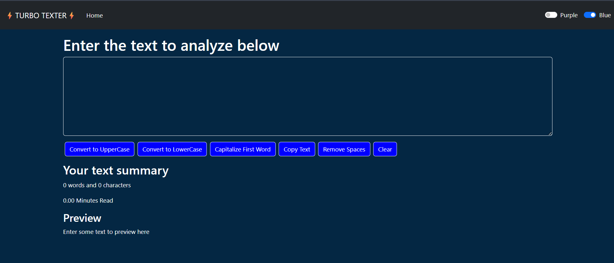

# ⚡ TURBO TEXTER ⚡

Turbo Texter is a simple yet powerful React-based text utility web app. It allows users to analyze and manipulate text with various tools including:

- 🔠 Convert to Uppercase / Lowercase  
- 📝 Capitalize First Word  
- 📋 Copy Text to Clipboard  
- 🧹 Remove Extra Spaces  
- 🧼 Clear Text  
- 🔵 Theme Toggle (Purple / Blue)

## 🖼️ Preview




## 🚀 Features

- **Real-time Text Summary:**  
  Displays word count, character count, and estimated reading time.

- **Text Transformations:**  
  Easy buttons to change case, clean up, or manipulate input text.

- **Live Preview:**  
  Shows the output instantly below the input box.

- **Dark Mode with Theme Toggle:**  
  Switch between Blue and Purple themes.

## 🛠️ Tech Stack

- React
- HTML / CSS / JavaScript
- Bootstrap (for styling)

## 📦 Installation

```bash
git clone https://github.com/your-username/turbo-texter.git
cd turbo-texter
npm install
npm start
